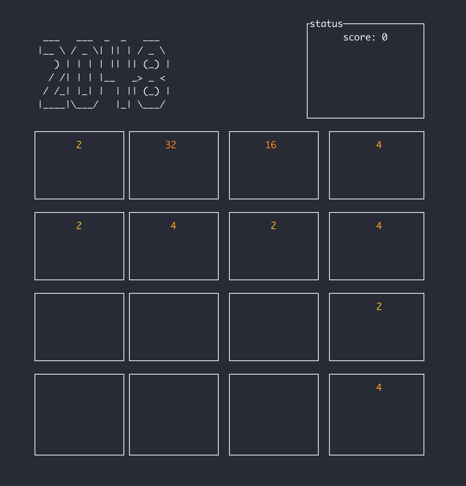

# tui-2048

A clone of 2048 game written in Rust

## Dependencies

* Rust
* tui-rs (https://github.com/fdehau/tui-rs)

## Screenshot

## How to play

This game uses vim-binded keys!

* h: Left
* j: Up
* k: Down
* l: Right